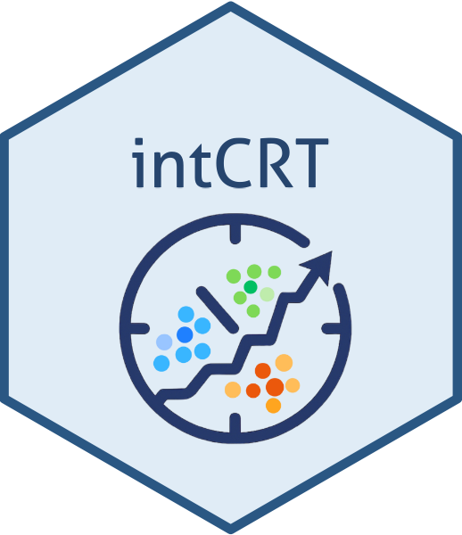

```{r}
#| echo: false
knitr::opts_chunk$set(
  collapse = TRUE,
  comment = "#>",
  fig.path = "man/README-"
)
```

# intCRT </a>

<!-- badges: start -->
<!-- badges: end -->

## Overview
intCRT R package provides tools for fitting and conducting inference on marginal Cox proportional hazard models for 
cluster-dependent and interval-censored time-to-event data. It is structured according to the method described in the 
[Cook et al.](https://pubmed.ncbi.nlm.nih.gov/36314377/) (2023), including the Botswana Combination Prevention Project as an applied example.

The package includes two sets of functions:

- functions to estimate the Cox ph model parameters (including both the regression coefficients and the baseline hazard functions) and
estimate their standard error

- functions to generate simulated clustered interval-censored dataset consistent with the structure of
the Botswana Combination Prevention Project

## Installation

You can install the development version of intCRT package from [GitHub](https://github.com/kwang64/intCRT) with:

``` r
# Install devtools if necessary
install.packages("devtools")

# Install intCRT from GitHub
devtools::install_github("yourusername/intCRT")
```

## Dependencies

- [`devtools`](https://cran.r-project.org/package=devtools)

- [`rootSolve`](https://cran.r-project.org/package=rootSolve)

- [`abind`](https://cran.r-project.org/package=abind)

- [`ggplot2`](https://cran.r-project.org/package=ggplot2)

- [`rmarkdown`](https://cran.r-project.org/package=rmarkdown)

- [`knitr`](https://cran.r-project.org/package=knitr)

- [`copula`](https://cran.r-project.org/package=copula)

- [`stabledist`](https://cran.r-project.org/package=stabledist)

These will be automatically imported when loading the package

## Core Functionalities

### Model Estimation

These are the main functions for fitting, summarizing, and visualizing the model:

- `composite_coxIC()`: fits a Cox proportional hazard regression model with interval censored data and obtain the composite maximum likelihood estimators.Supports optional stratification, clustering, time-varying covariates, and multiple methods for variance estimation.

- `summary.compCoxIC()`: prints out the summary of the fitted Cox proportional hazards model returned by `composite_coxIC()`.

- `plot.compCoxIC()`: visualizes the estimated baseline distribution functions from the output of `composite_coxIC()`.Users can plot cumulative hazard, survival, or cumulative incidence functions, either combined on one plot or separately by stratum.

### Data Pre-Processing and Estimation Internals
Helper functions used internally by `composite_coxIC()` (users typically do not need to call these directly):

- `process_data()`, `process_data_s()`, `cluster_to_stratum_mapping_i()`

- `em_init()`

- `point_iter()`, `calc_w()`, `w_s()`, `w_sv()`, `update_beta()`, `beta_score()`, `x_bar_s()`, `update_lambda()`, `update_lambda_s()`

- `composite()`, `composite_i_1()`,`composite_i_2()`,`composite_ij()`

- `variance_beta()`, `make_basis()`, `argmax_profile()`, `H()`, `J()`, `J_i_1()`, `J_i_2()`

### Data Simulation Tools
The following functions allow users to simulate clustered, interval-censored datasets resembling the Botswana Combination prevention Project:

- `gen_time_varying_cov()`, `gen_time_varying_cov_tx()`: Generate datasets with time-dependent covariates.

- `gen_time_dependent_beta()`, `gen_time_dependent_beta_tx()`: Generate datasets with time-varying treatment effects.

- `return_baseline()`, `return_exp_baseline()`: Generate baseline survival and hazard functions.

- `gen_visits_bcpp()`, `gen_visits_freq()`, `gen_visits_tx()`: Generate simulated clinic visit schdules.

## Botswana Combination Prevention Project (BCPP) 
intCRT package includes an analysis-ready dataset of HIV-negative individuals from the Botswana Combination Prevention Project (BCPP),
structured for survival analysis with clustered interval-censored data.

The data were sourced from the [publicly released data](https://data.cdc.gov/Global-Health/Botswana-Combination-Prevention-Project-BCPP-Publi/qcw5-4m9q/about_data) conducted by conducted by 
the Botswana Ministry of Health (MOH), Harvard School of Public Health/Botswana Harvard AIDS Institute Partnership (BHP), and the U.S. Centers for Disease Control and Prevention (CDC). 


## Vignette
A detailed vignette demonstrating model fitting, data simulation, and interpretation of results is available. 

Run this in R:

``` r
browseVignettes("intCRT")
```

